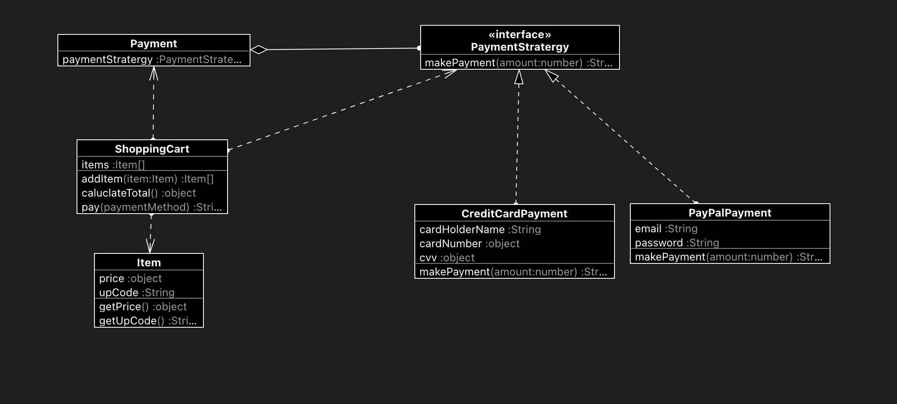

### Stratergy Pattern
Strategy pattern is used when we have multiple algorithm for a specific task and client decides the actual implementation to be used at runtime.
(In Plain words) Strategy pattern allows choosing the best-suited algorithm at runtime.

#### Problem
In e-commerce application, it needs to support the different kinds of payments. New payments methods emerges in the regular period of time. While from a business perspective the app was a success, the technical part caused you many headaches. Each time you added a new payment method/algorithm, the main class doubled in size. At some point, the beast became too hard to maintain.

Any change to one of the algorithms, whether it was a simple bug fix or a slight adjustment, affected the whole class, increasing the chance of creating an error in already-working code.

#### Solution
The Strategy pattern suggests that you take a class that does something specific in a lot of different ways and extract all of these algorithms into separate classes called strategies.

The original class, Context(Payment Class) contains the reference to one of the Payment Stratergies. So this, context delegates the work to a linked strategy object instead of executing it on its own.

The client (Shopping Cart Class) passe the desired strategy to the context (Payment Class). In fact, the context doesn’t know much about strategies.It works with all strategies through the same generic interface, which only exposes a single method for triggering the algorithm encapsulated within the selected strategy.

Finally, This way the context becomes independent of concrete strategies, so you can add new algorithms or modify existing ones without changing the code of the context or other strategies.

